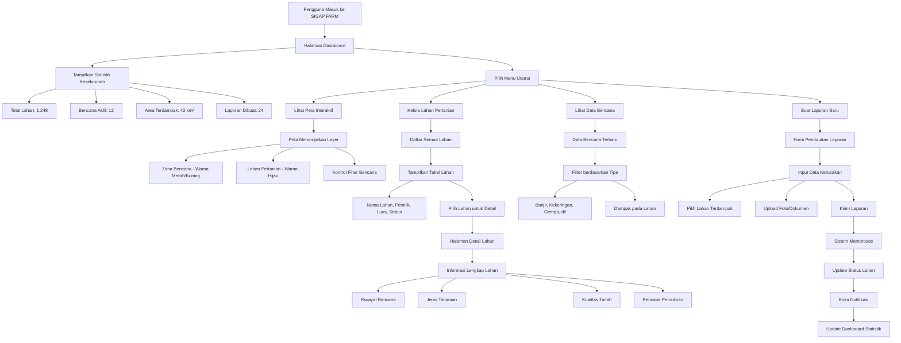
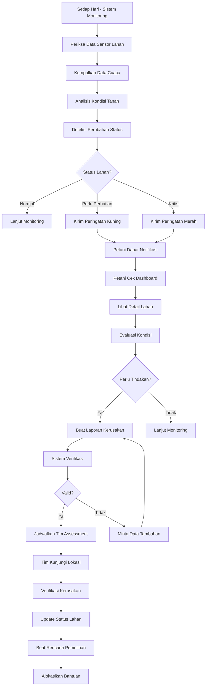
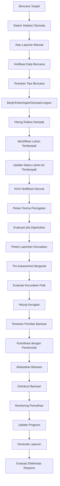

# Flowchart Aplikasi SIGAP FARM

## Alur Utama Aplikasi

SIGAP FARM adalah sistem informasi geospasial untuk manajemen pertanian pasca-bencana yang membantu petani dan pemangku kepentingan dalam:

1. **Monitoring Lahan Pertanian** - Melacak kondisi lahan secara real-time
2. **Pelacakan Bencana** - Mendeteksi dan memantau dampak bencana pada lahan
3. **Perencanaan Pemulihan** - Membuat strategi pemulihan pasca-bencana
4. **Pelaporan dan Analisis** - Generate laporan untuk pengambilan keputusan

## Alur Kerja Utama Sistem

## Alur Monitoring Harian

## Alur Respons Bencana

## Algoritma Terstruktur Aplikasi SIGAP FARM

### 1. ALGORITMA MONITORING LAHAN HARIAN

**DIMULAI DARI:** Sistem monitoring otomatis yang berjalan 24/7

**KONDISI AWAL:**
- Database lahan pertanian sudah terisi
- Sensor cuaca dan tanah aktif
- Sistem notifikasi siap

**LANGKAH-LANGKAH:**

1. **Pengumpulan Data** (Setiap 1 jam)
   - Baca data sensor kelembaban tanah
   - Ambil data cuaca dari API eksternal
   - Catat curah hujan dan suhu

2. **Analisis Kondisi** (Setiap 6 jam)
   - Bandingkan data dengan threshold normal
   - Hitung indeks kesehatan tanah (0-100)
   - Deteksi anomali: kekeringan, kelembaban berlebih

3. **Klasifikasi Status** (Setiap 12 jam)
   - **Normal (70-100)**: Kondisi baik, lanjut monitoring
   - **Perlu Perhatian (40-69)**: Kirim notifikasi peringatan
   - **Kritis (0-39)**: Kirim notifikasi darurat

4. **Tindakan Otomatis**
   - Jika kritis: Kirim SMS/email ke petani
   - Update status lahan di dashboard
   - Log ke database untuk analisis tren

**KONDISI AKHIR:** Status lahan terupdate, petani mendapat notifikasi jika perlu

---

### 2. ALGORITMA DETEKSI BENCANA

**DIMULAI DARI:** Sistem menerima data dari berbagai sumber

**KONDISI AWAL:**
- Sistem monitoring aktif
- Database zona risiko tersedia
- Sistem notifikasi darurat siap

**LANGKAH-LANGKAH:**

1. **Penerimaan Data Input**
   - Data sensor: curah hujan ekstrem, gempa, dll
   - Laporan manual dari petani/pemerintah
   - Data satelit untuk banjir/kekeringan

2. **Validasi Data**
   - Periksa akurasi sensor
   - Cross-reference dengan data stasiun cuaca resmi
   - Filter noise dan false positive

3. **Analisis Pola**
   - Bandingkan dengan pola bencana historis
   - Hitung intensitas berdasarkan skala (1-5)
   - Tentukan tipe bencana spesifik

4. **Penentuan Level Peringatan**
   - **Level 1 (Hijau)**: Potensi rendah, pantau saja
   - **Level 2 (Kuning)**: Potensi sedang, siapkan langkah pencegahan
   - **Level 3 (Merah)**: Potensi tinggi, aktifkan protokol darurat

5. **Distribusi Peringatan**
   - Kirim ke petani di zona terdampak
   - Update dashboard dengan zona risiko
   - Berkoordinasi dengan BPBD setempat

**KONDISI AKHIR:** Semua stakeholder mendapat informasi akurat tentang bencana

---

### 3. ALGORITMA PENILAIAN DAMPAK BENCANA

**DIMULAI DARI:** Setelah bencana terdeteksi atau dilaporkan

**KONDISI AWAL:**
- Data bencana sudah tervalidasi
- Koordinat lokasi bencana diketahui
- Database lahan pertanian lengkap

**LANGKAH-LANGKAH:**

1. **Penentuan Area Dampak**
   - Hitung radius berdasarkan tipe bencana:
     - Banjir: radius 5-20km tergantung intensitas
     - Gempa: radius berdasarkan magnitudo
     - Kekeringan: area berdasarkan curah hujan
   - Buat polygon area terdampak

2. **Identifikasi Lahan Terdampak**
   - Query database lahan dalam polygon
   - Hitung jarak setiap lahan dari pusat bencana
   - Kategorikan: langsung terdampak, tidak langsung

3. **Assessment Kerusakan**
   - **Visual Assessment**: Foto udara/satelit
   - **Ground Survey**: Tim survey lapangan
   - **Sensor Data**: Perubahan data sensor drastis

4. **Klasifikasi Tingkat Kerusakan**
   - **Ringan (0-25%)**: Tanaman masih bisa diselamatkan
   - **Sedang (26-50%)**: Perlu perawatan intensif
   - **Berat (51-75%)**: Perlu tanam ulang sebagian
   - **Kritis (76-100%)**: Tanam ulang total

5. **Update Database**
   - Update status lahan
   - Catat riwayat bencana
   - Update statistik dashboard

**KONDISI AKHIR:** Setiap lahan memiliki assessment kerusakan yang akurat

---

### 4. ALGORITMA PERENCANAAN PEMULIHAN

**DIMULAI DARI:** Setelah assessment dampak selesai

**KONDISI AWAL:**
- Data kerusakan lahan sudah ada
- Informasi jenis tanaman tersedia
- Data biaya dan ketersediaan bahan ada

**LANGKAH-LANGKAH:**

1. **Evaluasi Kebutuhan**
   - Tentukan jenis tanaman pengganti
   - Hitung luas area yang perlu ditanami ulang
   - Identifikasi kebutuhan bibit, pupuk, pestisida

2. **Perhitungan Waktu Pemulihan**
   - **Ringan**: 1-2 minggu (perawatan saja)
   - **Sedang**: 2-4 minggu (perbaikan + tanam tambahan)
   - **Berat**: 1-3 bulan (tanam ulang sebagian)
   - **Kritis**: 3-6 bulan (persiapan lahan + tanam ulang total)

3. **Estimasi Biaya**
   - Biaya bibit per hektar
   - Biaya tenaga kerja
   - Biaya pupuk dan pestisida
   - Biaya transportasi dan distribusi

4. **Prioritas Bantuan**
   - Lahan kritis mendapat prioritas tinggi
   - Pertimbangkan jumlah petani terdampak
   - Evaluasi dampak ekonomi

5. **Pembuatan Rencana**
   - Timeline kegiatan harian/mingguan
   - Jadwal distribusi bantuan
   - Monitoring progress pemulihan

**KONDISI AKHIR:** Rencana pemulihan terstruktur siap dieksekusi

---

### 5. ALGORITMA MANAJEMEN LAPORAN

**DIMULAI DARI:** Petani membuat laporan kerusakan

**KONDISI AWAL:**
- Form laporan tersedia
- Sistem validasi aktif
- Database laporan kosong untuk laporan baru

**LANGKAH-LANGKAH:**

1. **Input Data Laporan**
   - Pilih lahan yang terdampak
   - Upload foto kerusakan
   - Isi detail: jenis kerusakan, estimasi luas, dll

2. **Validasi Otomatis**
   - Periksa kelengkapan data
   - Validasi format foto (ukuran, tipe file)
   - Cross-check dengan data bencana

3. **Verifikasi Manual**
   - Tim validator meninjau laporan
   - Bandingkan dengan data lapangan
   - Konfirmasi atau minta revisi

4. **Proses Approval**
   - Jika valid: setujui dan proses bantuan
   - Jika perlu revisi: kirim feedback ke petani
   - Jika ditolak: berikan alasan penolakan

5. **Distribusi Bantuan**
   - Update status laporan
   - Kirim notifikasi ke petani
   - Jadwalkan distribusi bantuan

**KONDISI AKHIR:** Laporan diproses, bantuan terdistribusi, database terupdate

## Ringkasan Alur Aplikasi SIGAP FARM

Aplikasi SIGAP FARM bekerja dengan alur sebagai berikut:

### 1. **Masuk ke Dashboard**
   - Pengguna mengakses aplikasi → redirect otomatis ke dashboard
   - Dashboard menampilkan ringkasan data: statistik lahan, bencana aktif, area terdampak

### 2. **Monitoring Lahan Harian**
   - Sistem memantau kondisi lahan 24/7
   - Deteksi perubahan status lahan (normal → perhatian → kritis)
   - Kirim notifikasi otomatis ke petani jika ada masalah

### 3. **Respons Bencana**
   - Deteksi bencana otomatis atau laporan manual
   - Identifikasi lahan terdampak dalam radius bencana
   - Update status lahan dan kirim peringatan darurat

### 4. **Manajemen Laporan**
   - Petani membuat laporan kerusakan
   - Tim assessment verifikasi di lapangan
   - Sistem buat rencana pemulihan dan alokasi bantuan

### 5. **Pemetaan dan Visualisasi**
   - Peta interaktif menampilkan zona bencana (merah/kuning)
   - Lahan pertanian (hijau) dengan status terkini
   - Filter berdasarkan tipe bencana

### Algoritma Utama Sistem:

**Algoritma Deteksi Bencana:**
1. Kumpulkan data cuaca, sensor, dan laporan
2. Analisis pola untuk mendeteksi anomali
3. Hitung probabilitas terjadinya bencana
4. Kirim peringatan dini jika threshold tercapai

**Algoritma Assessment Dampak:**
1. Terima data bencana (lokasi, tipe, intensitas)
2. Hitung radius dampak berdasarkan tipe bencana
3. Identifikasi semua lahan dalam radius tersebut
4. Klasifikasi kerusakan: Ringan/Sedang/Berat/Kritis

**Algoritma Perencanaan Pemulihan:**
1. Evaluasi kerusakan per lahan
2. Hitung waktu dan biaya pemulihan
3. Buat rencana prioritas bantuan
4. Monitor progress pemulihan

Flowchart di atas menunjukkan bagaimana SIGAP FARM membantu petani dari deteksi dini bencana hingga pemulihan pasca-bencana secara terstruktur dan sistematis.