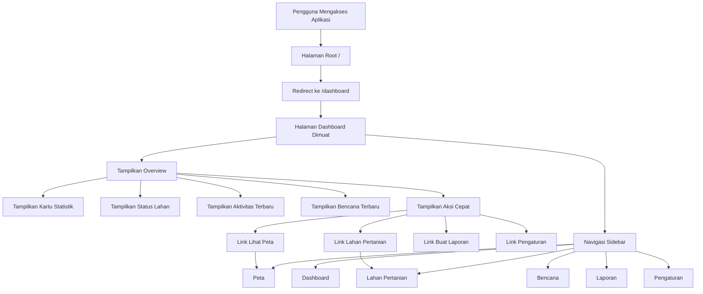
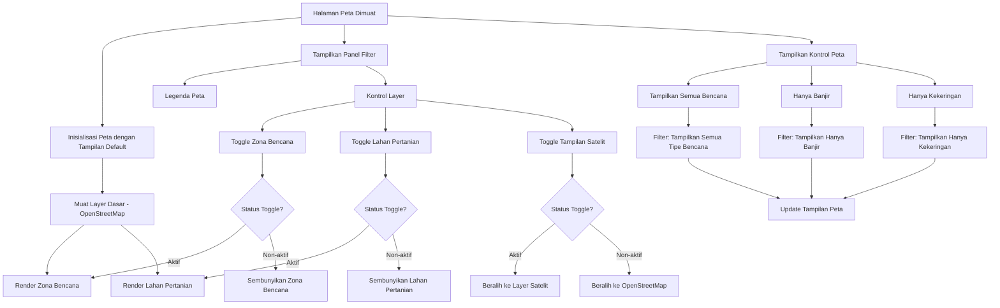
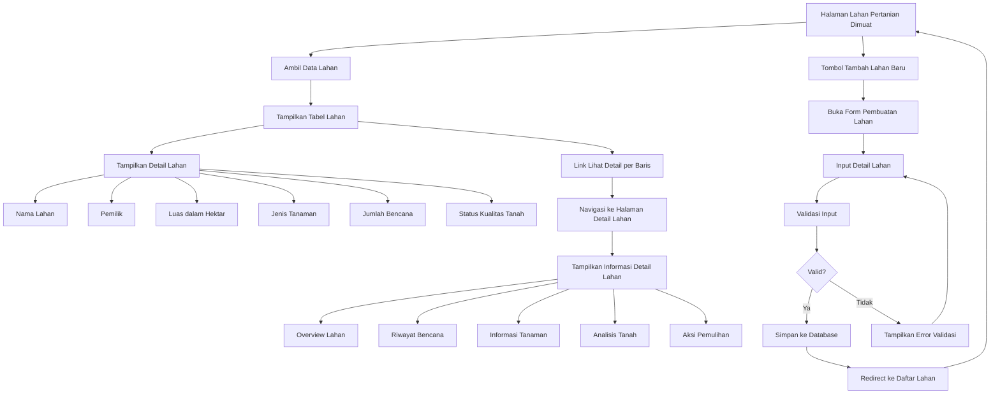
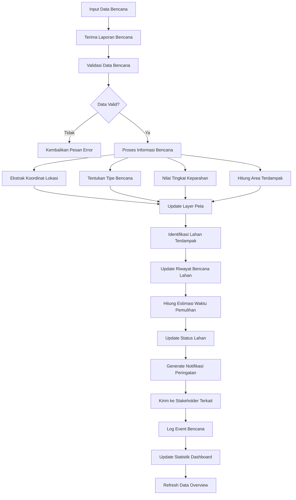
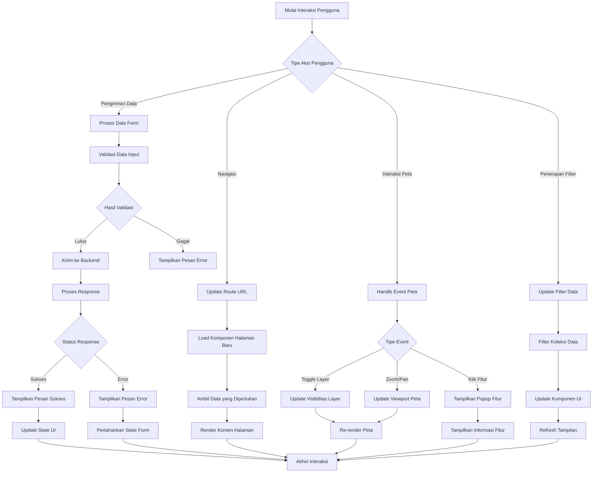

# Flowchart dan Algoritma Aplikasi SIGAP FARM

## Gambaran Aplikasi
SIGAP FARM (Sistem Informasi Geospasial untuk Pertanian Pasca-Bencana) adalah sistem informasi geospasial untuk manajemen pertanian pasca-bencana. Aplikasi ini menyediakan overview dashboard, pemetaan interaktif, manajemen lahan pertanian, dan kemampuan pelacakan bencana.

## Flowchart Navigasi Utama



## Flowchart Halaman Peta



## Flowchart Manajemen Lahan Pertanian



## Algoritma Pelacakan Bencana



## Algoritma Interaksi Pengguna



## Algoritma Utama

### 1. Algoritma Rendering Peta
```
1. Inisialisasi container peta dengan koordinat pusat dan level zoom
2. Muat layer tile dasar (OpenStreetMap atau Satelit)
3. Periksa pengaturan visibilitas layer dari store
4. Jika layer zona bencana diaktifkan:
   - Ambil data zona bencana
   - Buat overlay poligon dengan kode warna berdasarkan keparahan
   - Tambahkan informasi popup untuk setiap zona
5. Jika layer lahan pertanian diaktifkan:
   - Ambil data lahan pertanian
   - Buat overlay poligon untuk batas lahan
   - Tambahkan popup dengan detail lahan
6. Terapkan filter saat ini (tipe bencana, rentang tanggal, dll.)
7. Tambahkan kontrol zoom dan layer
8. Handle interaksi pengguna (zoom, pan, klik)
```

### 2. Perhitungan Statistik Dashboard
```
1. Query database untuk data lahan pertanian
2. Hitung total lahan pertanian
3. Hitung area terdampak bencana
4. Tentukan distribusi status lahan (sehat, perlu perhatian, kritis, tidak diketahui)
5. Hitung rata-rata waktu pemulihan
6. Hitung persentase tingkat respons
7. Generate data tren untuk periode terbaru
8. Update kartu dashboard dengan nilai yang dihitung
```

### 3. Penilaian Dampak Bencana
```
1. Terima data event bencana (tipe, lokasi, keparahan)
2. Tentukan radius dampak berdasarkan tipe bencana
3. Query lahan pertanian dalam area dampak
4. Untuk setiap lahan terdampak:
   - Update riwayat bencana
   - Nilai level kerusakan
   - Hitung timeline pemulihan
   - Update status kualitas tanah
5. Generate laporan dampak
6. Kirim notifikasi ke pemilik lahan terdampak
7. Update statistik seluruh sistem
```

Flowchart dan dokumentasi algoritma ini memberikan gambaran komprehensif tentang struktur aplikasi SIGAP FARM, alur pengguna, dan logika pemrosesan utama.